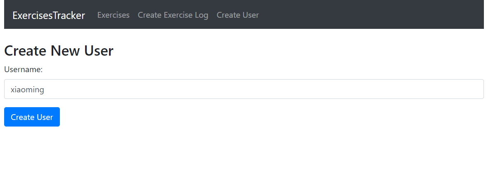
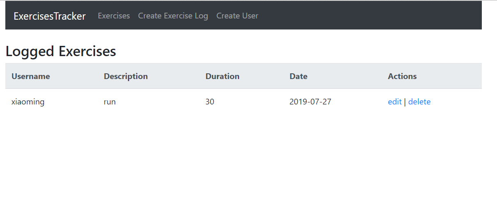
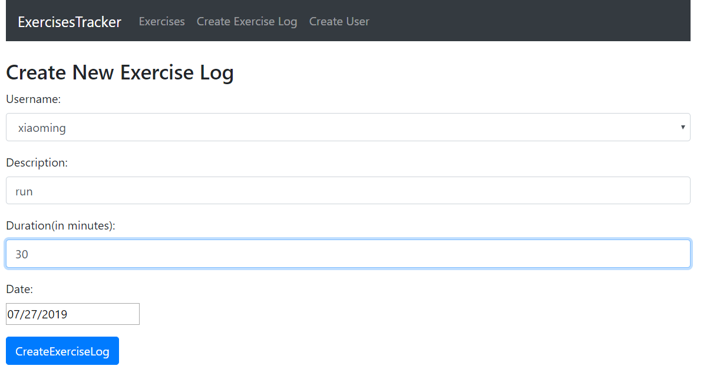

## 前言
这是一个用于记录锻炼时间的List,前端使用`react+react-router+axios+bootstrap`开发的，后端使用`express+mongoose`开发的接口。
## 功能
- [x] 新建用户
- [x] 运动记录管理（增加，删除，修改，更新）
## 构建安装（Build Setup）
```
# 安装后端依赖
cd backend
npm i
# 启动服务
npm i -g nodemon (如果安装过，忽略这条)
nodemon server.js
# 注意：需要安装MongoDB数据库，并且创建数据库react-tracker,服务开启后显示：
Server is running on port:3000
MongoDB database connection established successfully

# 安装前端依赖
cd ..
npm i 
# 启动
npm run start (可能会有端口号冲突，直接输入yes即可)

```
## 写在最后
全栈修炼的第一步
